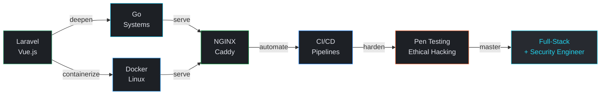

<div align="center">


<br/>


&nbsp;

&nbsp;

&nbsp;


</div>

---

<table width="100%">
<tr>
<td width="50%" valign="top">

### 01 — Identity

```
Name      atx9ine
Type      Self-taught Developer
Track     Full-Stack → Security
Status    Always building
```

Building practical software today while learning the systems that power tomorrow. Full-stack foundation with a growing focus on infrastructure, DevOps, and ethical hacking.

> *"Full-stack with a hacker's mind."*

</td>
<td width="50%" valign="top">

### 02 — Current Focus

| Module | Status |
|---|---|
| Laravel · Vue.js | `● active` |
| PostgreSQL · Supabase | `● active` |
| N8N · WordPress | `● active` |
| Go · Docker · Linux | `→ learning` |
| NGINX · Caddy · CI/CD | `→ learning` |
| Pen Testing · Security | `⚠ acquiring` |

</td>
</tr>
</table>

---

### Stack

<table width="100%">
<tr>
<td width="25%" align="center" valign="top">

**Production**


</td>
<td width="25%" align="center" valign="top">

**Infrastructure**


</td>
<td width="25%" align="center" valign="top">

**Security**


</td>
<td width="25%" align="center" valign="top">

**Databases & AI**


</td>
</tr>
</table>

---

### Roadmap



---

### Principles

<table width="100%">
<tr>
<td width="33%" align="center">

**Engineering**
```
Write clean code.
Think in systems.
Document everything.
```

</td>
<td width="33%" align="center">

**Security**
```
Build it. Break it.
Harden it.
Secure by default.
```

</td>
<td width="33%" align="center">

**Mindset**
```
Automate the rest.
Consistent > fast.
Never stop learning.
```

</td>
</tr>
</table>

---

### Connect

<div align="center">

[](https://github.com/atx9ine)
&nbsp;
[](https://linkedin.com/in/atx9ine)
&nbsp;
[](https://x.com/atx9ine)
&nbsp;
[](https://threads.net/@atx9ine)

<br/>


</div>

<!--
  atx9ine design system
  Background  : #101419
  Surface     : #1d2025
  Primary     : #2563EB → #b4c5ff
  Cyan        : #22D3EE → #5de6ff
  Amber       : #ffb95f
  Outline     : #434655
  On-Surface  : #e0e2ea
  Identity    : Minimal · Engineering · Systems · Precision · Security
-->
