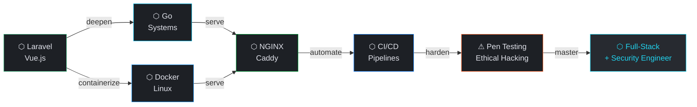

<div align="center">


<br/>


&nbsp;

&nbsp;


</div>

---

```bash
atx9ine@system:~$ ./boot --identity --verbose
```
```
[  OK  ] identity............. atx9ine
[  OK  ] foundation........... Full-Stack Web Development
[  OK  ] stack................ Laravel · Vue.js · PostgreSQL
[  OK  ] learning............. Go · Docker · Linux · NGINX · Caddy · CI/CD
[  OK  ] automation........... N8N · WordPress · WooCommerce
[  OK  ] security track....... Pen Testing · Ethical Hacking
[ BOOT  ] philosophy........... Build. Deploy. Secure.
▶ all systems nominal.
```

---

<div align="center">

## `~/stack` — Production


## `~/stack` — Databases


## `~/stack` — Infrastructure `[→ learning]`


## `~/stack` — Security `[→ acquiring]`


## `~/stack` — AI & Automation


</div>

---

```bash
atx9ine@system:~$ systemctl status --all
```

```
SERVICE                       STATUS         UPTIME
──────────────────────────────────────────────────────────────
laravel.service             ● active         core backend
vuejs.service               ● active         frontend layer  
postgresql.service          ● active         primary db
n8n-automation.service      ● active         AI workflows
wordpress.service           ● active         CMS + ecommerce

go-lang.service             → learning       systems language
docker.service              → learning       containerization
nginx.service               → learning       reverse proxy
caddy.service               → learning       modern web server
cicd.service                → learning       deploy pipelines
linux-internals.service     → learning       deep OS knowledge

pentesting.service          ⚠ acquiring     ethical hacking
security-audit.service      ⚠ acquiring     recon · offense · defense
```

---

<div align="center">

## `~/roadmap`

</div>



---

```bash
atx9ine@system:~$ cat philosophy.conf
```

```ini
[engineering]
code         = clean · typed · documented
architecture = think in systems, not just features
security     = if you built it, learn to break it

[automation]
rule         = if you do it twice, automate it
tools        = n8n · github actions · bash

[mindset]
pace         = consistent > fast
direction    = full-stack → infrastructure → security
goal         = build software that is scalable, reliable, and secure
```

---

<div align="center">

## `~/connect`

[](https://github.com/atx9ine)
[](https://linkedin.com/in/atx9ine)
[](https://x.com/atx9ine)
[](https://threads.net/@atx9ine)

<br/>


</div>

<!--
  atx9ine design system
  Background  : #101419
  Surface     : #1d2025
  Cards       : #141B25
  Primary     : #2563EB
  Cyan        : #22D3EE
  Amber       : #ffb95f
  Identity    : Minimal · Engineering · Systems · Precision · Security
-->
