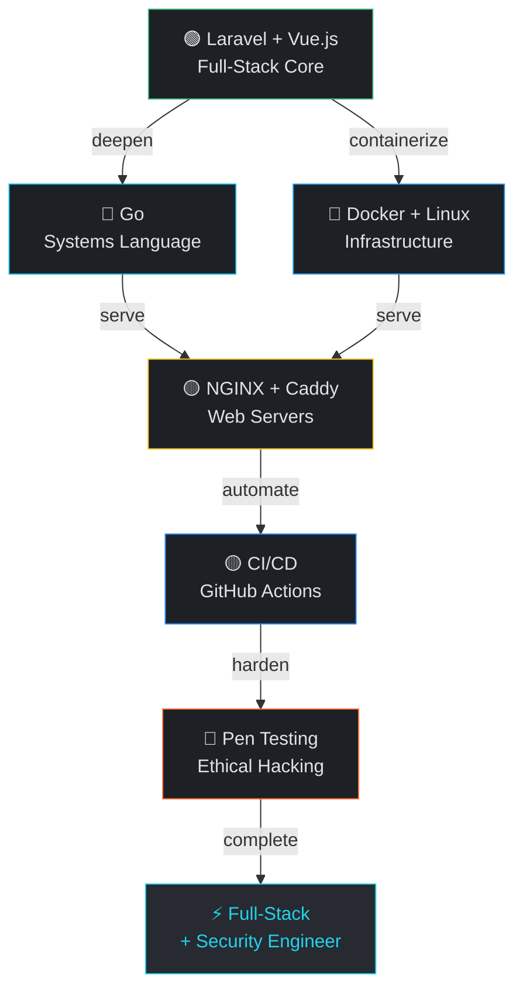

<div align="center">


<!-- ANIMATED TYPING HEADER -->


<br/>


<br/><br/>


</div>

---

```bash
┌─[atx9ine@system]─[~]
└──╼ $ ./boot.sh --verbose
```

```ansi
[1;36m[  INIT  ][0m Loading identity manifest.................. [1;32matx9ine[0m
[1;36m[  OK   ][0m Stack verified............................. [1;33mLaravel · Vue.js[0m
[1;36m[  OK   ][0m Automation layer active.................... [1;35mN8N · WordPress · WooCommerce[0m
[1;33m[  LOAD  ][0m Learning modules queued.................... [1;34mGo · Docker · Linux · NGINX · Caddy · CI/CD[0m
[1;31m[ WARN  ][0m Offensive security clearance............... [1;31macquiring → Pen Testing[0m
[1;36m[  OK   ][0m Philosophy loaded.......................... [1;32mBuild. Deploy. Secure.[0m
[1;37m━━━━━━━━━━━━━━━━━━━━━━━━━━━━━━━━━━━━━━━━━━━━━━━━━━━━━━━[0m
[1;36m▶[0m [1;37matx9ine is online. All systems nominal.[0m
```

---

```bash
┌─[atx9ine@system]─[~/identity]
└──╼ $ cat profile.conf
```

```ini
[identity]
name        = atx9ine
type        = self-taught developer
foundation  = full-stack web development
expanding   = systems · infrastructure · DevOps · cybersecurity
philosophy  = "Full-stack with a hacker's mind."

[mission]
today       = build practical, reliable software
tomorrow    = understand the systems that power it
always      = secure by default. automate everything.
```

---

```bash
┌─[atx9ine@system]─[~/stack]
└──╼ $ ls -la --color=always
```

<div align="center">

### 🟢 &nbsp; Production &nbsp; `● active`


### 🔵 &nbsp; Databases &nbsp; `● active`


### 🟡 &nbsp; Infrastructure &nbsp; `→ learning`


### 🔴 &nbsp; Security &nbsp; `⚠ acquiring`


### 🟣 &nbsp; AI & Automation &nbsp; `● active`


</div>

---

```bash
┌─[atx9ine@system]─[~/processes]
└──╼ $ systemctl status --all
```

```
SERVICE                       STATUS          COLOR
──────────────────────────────────────────────────────────────
laravel.service             ● ACTIVE    →    backend core
vuejs.service               ● ACTIVE    →    frontend layer
postgresql.service          ● ACTIVE    →    primary database
n8n-automation.service      ● ACTIVE    →    AI workflows
wordpress.service           ● ACTIVE    →    CMS + ecommerce

go-lang.service             → LEARNING  →    systems language
docker.service              → LEARNING  →    containerization
nginx.service               → LEARNING  →    reverse proxy
caddy.service               → LEARNING  →    modern web server
cicd-pipeline.service       → LEARNING  →    deploy automation
linux-internals.service     → LEARNING  →    deep OS knowledge

pentesting.service          ⚠ ACQUIRING →    ethical hacking
security-audit.service      ⚠ ACQUIRING →    recon · offense · defense
```

---

```bash
┌─[atx9ine@system]─[~/roadmap]
└──╼ $ cat path.mmd | mermaid render
```



---

```bash
┌─[atx9ine@system]─[~/config]
└──╼ $ cat philosophy.conf
```

```ini
# ── Engineering ──────────────────────────────────────────────
[build]
code_quality     = clean · typed · documented
architecture     = think in systems, not just features
automation       = if you do it twice, automate it

# ── Security ─────────────────────────────────────────────────
[security]
mindset          = if you built it, learn to break it
approach         = offensive thinking → defensive engineering
default          = secure by design, never by patch

# ── Mindset ──────────────────────────────────────────────────
[growth]
pace             = consistent > fast
direction        = full-stack → infrastructure → security
truth            = never stop learning
```

---

```bash
┌─[atx9ine@system]─[~/connect]
└──╼ $ ping --all-nodes
```

```
PING atx9ine social layer...

64 bytes from  🐙  GitHub    ──  github.com/atx9ine
64 bytes from  💼  LinkedIn  ──  linkedin.com/in/atx9ine
64 bytes from  𝕏   X         ──  x.com/atx9ine
64 bytes from  @   Threads   ──  threads.net/@atx9ine

── 4 packets transmitted · 4 received · 0% packet loss ──
```

<div align="center">

[](https://github.com/atx9ine)
&nbsp;
[](https://linkedin.com/in/atx9ine)
&nbsp;
[](https://x.com/atx9ine)
&nbsp;
[](https://threads.net/@atx9ine)

<br/>


</div>

<!--
  atx9ine design system
  Background           : #0b0e13
  Surface              : #1d2025
  Surface-high         : #272a30
  Primary Blue         : #2563EB  →  #b4c5ff
  Secondary Cyan       : #22D3EE  →  #5de6ff
  Tertiary Amber       : #ffb95f
  Security Orange      : #FF6B35
  Outline              : #434655
  On-Surface           : #e0e2ea
  On-Surface-Variant   : #c3c6d7
  Font Display         : Geist 700
  Font Code/Labels     : JetBrains Mono 500
  Identity             : Minimal · Engineering · Systems · Precision · Security
-->
