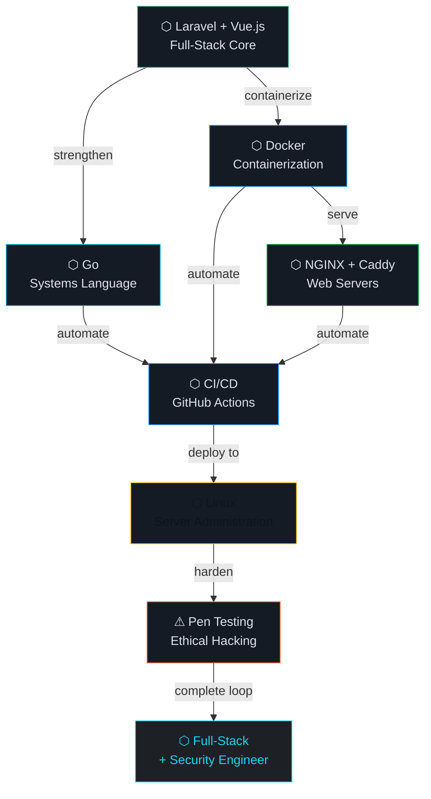

<div align="center">

<!-- SYSTEM BOOT SEQUENCE -->

```
░█████╗░████████╗██╗░░██╗░█████╗░██╗███╗░░██╗███████╗
██╔══██╗╚══██╔══╝╚██╗██╔╝██╔══██╗██║████╗░██║██╔════╝
███████║░░░██║░░░░╚███╔╝░╚██████║██║██╔██╗██║█████╗░░
██╔══██║░░░██║░░░░██╔██╗░░╚═══██║██║██║╚████║██╔══╝░░
██║░░██║░░░██║░░░██╔╝╚██╗░█████╔╝██║██║░╚███║███████╗
╚═╝░░╚═╝░░░╚═╝░░░╚═╝░░╚═╝░╚════╝░╚═╝╚═╝░░╚══╝╚══════╝
```


</div>

---

```bash
atx9ine@system:~$ ./boot --identity --verbose
```

```
[  OK  ] Loaded identity profile.............. atx9ine
[  OK  ] Stack verified....................... Laravel · Vue.js
[  OK  ] Learning modules active.............. Go · Docker · Linux · NGINX · Caddy · CI/CD
[  OK  ] Offensive security track............ Pen Testing · Active
[  OK  ] AI Automation layer................. N8N · WordPress · WooCommerce
[ WARN  ] Ethical hacking clearance........... acquiring...
[  OK  ] System philosophy loaded............ Build. Deploy. Secure.
━━━━━━━━━━━━━━━━━━━━━━━━━━━━━━━━━━━━━━━━━━━━━━━━━━━━━━━━━
▶ atx9ine is online.
```

---

```bash
atx9ine@system:~$ cat /proc/identity
```

```
┌─────────────────────────────────────────────────────────┐
│                                                         │
│  NAME     →  atx9ine                                    │
│  TYPE     →  Self-taught · Full-Stack Developer         │
│  TRACK    →  Web Engineering + Ethical Hacking          │
│  MISSION  →  Build scalable software. Hack it to       │
│              harden it. Automate the rest.              │
│                                                         │
│  TAGLINE  →  "Full-stack with a hacker's mind."        │
│                                                         │
└─────────────────────────────────────────────────────────┘
```

---

## `$ ls ~/stack --icons --color`

<br>

### ⬡ Production Stack

<div align="center">


</div>

### ⬡ Infrastructure & DevOps `[→ learning]`

<div align="center">


</div>

### ⬡ Security `[→ learning]`

<div align="center">


</div>

### ⬡ AI & No-Code Automation

<div align="center">


</div>

---

```bash
atx9ine@system:~$ systemctl status --all
```

```
SERVICE                     STATUS          NOTES
────────────────────────────────────────────────────────────
laravel.service           ● active         backend foundation
vuejs.service             ● active         frontend UI layer
postgresql.service        ● active         primary database
n8n-automation.service    ● active         AI workflow engine
wordpress.service         ● active         CMS · WooCommerce

docker.service            → learning       containerization
go-lang.service           → learning       systems programming
nginx.service             → learning       web server config
caddy.service             → learning       modern reverse proxy
cicd-pipeline.service     → learning       github actions · automation
linux-internals.service   → learning       deep OS knowledge

pentesting.service        ⚠ acquiring     ethical hacking track
security-audit.service    ⚠ acquiring     recon · exploitation · defense
```

---

```bash
atx9ine@system:~$ cat roadmap.mmd | mermaid render
```



---

```bash
atx9ine@system:~$ cat philosophy.conf
```

```ini
[build]
approach     = ship working software first, optimize second
architecture = think in systems, not just features
code         = clean, typed, documented

[security]
mindset      = if you built it, you can break it
method       = pen test your own systems
default      = secure by design, not by patch

[automation]
rule         = if you do it twice, automate it
tools        = n8n · github actions · bash scripts
goal         = more building, less repetition

[growth]
direction    = full-stack → infrastructure → offensive security
philosophy   = understand the stack from top to bottom
pace         = consistent > fast
```

---

```bash
atx9ine@system:~$ ping connect.atx9ine --all-nodes
```

```
PING atx9ine social layer...

64 bytes from GitHub    — github.com/atx9ine
64 bytes from LinkedIn  — linkedin.com/in/atx9ine
64 bytes from X         — x.com/atx9ine
64 bytes from Threads   — threads.net/@atx9ine

4 packets transmitted · 4 received · 0% loss
```

---

<div align="center">

```
╔═══════════════════════════════════════════════════════╗
║                                                       ║
║   atx9ine // Full-Stack Developer · Hacker in        ║
║   Training · AI Automation Engineer                  ║
║                                                       ║
║         [ Build. Deploy. Secure. ]                   ║
║                                                       ║
║   Always building. Always learning. Always hacking.  ║
║                                                       ║
╚═══════════════════════════════════════════════════════╝
```


</div>

<!--
  atx9ine design system
  Background  : #101419
  Surface     : #1d2025
  Cards       : #141B25
  Borders     : #434655
  Primary     : #2563EB → #b4c5ff
  Cyan        : #22D3EE → #5de6ff
  Amber       : #F59E0B → #ffb95f
  Font        : Geist (display) · JetBrains Mono (code/labels)
  Identity    : Minimal · Engineering · Systems · Precision · Security
-->
