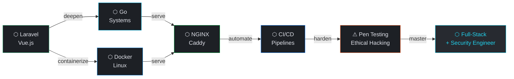

<div align="center">

```
░█████╗░████████╗██╗░░██╗░█████╗░██╗███╗░░██╗███████╗
██╔══██╗╚══██╔══╝╚██╗██╔╝██╔══██╗██║████╗░██║██╔════╝
███████║░░░██║░░░░╚███╔╝░╚██████║██║██╔██╗██║█████╗░░
██╔══██║░░░██║░░░░██╔██╗░░╚═══██║██║██║╚████║██╔══╝░░
██║░░██║░░░██║░░░██╔╝╚██╗░█████╔╝██║██║░╚███║███████╗
╚═╝░░╚═╝░░░╚═╝░░░╚═╝░░╚═╝░╚════╝░╚═╝╚═╝░░╚══╝╚══════╝
```


</div>

---

```bash
atx9ine@system:~$ ./boot --identity --verbose
```
```
[  OK  ] identity............. atx9ine
[  OK  ] foundation........... Full-Stack Web Development
[  OK  ] stack................ Laravel · Vue.js · PostgreSQL
[  OK  ] learning............. Go · Docker · Linux · NGINX · Caddy · CI/CD
[  OK  ] automation........... N8N · WordPress · WooCommerce
[  OK  ] security track....... Pen Testing · Ethical Hacking
[ BOOT  ] philosophy........... Build. Deploy. Secure.
▶ all systems nominal.
```

---

```bash
atx9ine@system:~$ cat /proc/identity
```

```
┌─────────────────────────────────────────────────────────┐
│                                                         │
│  NAME     →  atx9ine                                    │
│  TYPE     →  Self-taught · Full-Stack Developer         │
│  TRACK    →  Web Engineering + Ethical Hacking          │
│  MISSION  →  Build scalable software. Hack it to        │
│              harden it. Automate the rest.              │
│                                                         │
│  TAGLINE  →  "Full-stack with a hacker's mind."         │
│                                                         │
└─────────────────────────────────────────────────────────┘
```

---

```bash
atx9ine@system:~$ ls -la ~/stack/
```

```
drwxr-xr-x   languages/
│   ├── PHP
│   ├── JavaScript
│   ├── TypeScript
│   └── SQL

drwxr-xr-x   frameworks/
│   ├── Laravel
│   ├── Vue.js
│   ├── Nuxt
│   └── NestJS

drwxr-xr-x   databases/
│   ├── PostgreSQL
│   ├── MySQL
│   └── Supabase

drwxr-xr-x   infrastructure/     [→ learning]
│   ├── Go
│   ├── Docker
│   ├── Linux
│   ├── NGINX
│   ├── Caddy
│   └── CI/CD

drwxr-xr-x   security/           [⚠ acquiring]
│   ├── Pen Testing
│   ├── Kali Linux
│   ├── Burp Suite
│   └── Wireshark

drwxr-xr-x   automation/
│   ├── N8N
│   ├── WordPress
│   └── WooCommerce
```

---

```bash
atx9ine@system:~$ systemctl status --all
```

```
SERVICE                       STATUS          NOTES
──────────────────────────────────────────────────────────────
laravel.service             ● active         core backend
vuejs.service               ● active         frontend layer
postgresql.service          ● active         primary database
n8n-automation.service      ● active         AI workflows
wordpress.service           ● active         CMS + ecommerce

go-lang.service             → learning       systems language
docker.service              → learning       containerization
nginx.service               → learning       reverse proxy
caddy.service               → learning       modern web server
cicd-pipeline.service       → learning       deploy automation
linux-internals.service     → learning       deep OS knowledge

pentesting.service          ⚠ acquiring     ethical hacking
security-audit.service      ⚠ acquiring     recon · offense · defense
```

---

```bash
atx9ine@system:~$ cat roadmap.mmd | mermaid render
```



---

```bash
atx9ine@system:~$ cat philosophy.conf
```

```ini
[build]
approach     = ship working software first, optimize second
architecture = think in systems, not just features
code         = clean · typed · documented

[security]
mindset      = if you built it, you can break it
method       = pen test your own systems
default      = secure by design, not by patch

[automation]
rule         = if you do it twice, automate it
tools        = n8n · github actions · bash scripts
goal         = more building, less repetition

[growth]
direction    = full-stack → infrastructure → offensive security
philosophy   = understand the stack from top to bottom
pace         = consistent > fast
```

---

```bash
atx9ine@system:~$ ping connect.atx9ine --all-nodes
```

```
PING atx9ine social layer...

64 bytes from GitHub    — github.com/atx9ine
64 bytes from LinkedIn  — linkedin.com/in/atx9ine
64 bytes from X         — x.com/atx9ine
64 bytes from Threads   — threads.net/@atx9ine

4 packets transmitted · 4 received · 0% loss
```

---

<div align="center">

```
╔═══════════════════════════════════════════════════════╗
║                                                       ║
║   atx9ine  //  Full-Stack · Hacker in Training        ║
║             AI Automation Engineer                    ║
║                                                       ║
║         [ Build. Deploy. Secure. ]                   ║
║                                                       ║
║   Always building. Always learning. Always hacking.  ║
║                                                       ║
╚═══════════════════════════════════════════════════════╝
```


</div>

<!--
  atx9ine design system
  Background  : #0b0e13
  Surface     : #1d2025
  Primary     : #2563EB
  Cyan        : #22D3EE
  Amber       : #ffb95f
  Outline     : #434655
  On-Surface  : #e0e2ea
  Font        : JetBrains Mono
  Identity    : Minimal · Engineering · Systems · Precision · Security
-->
